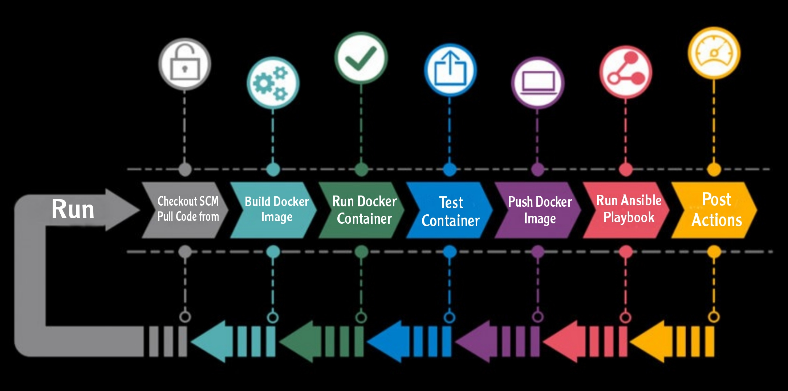
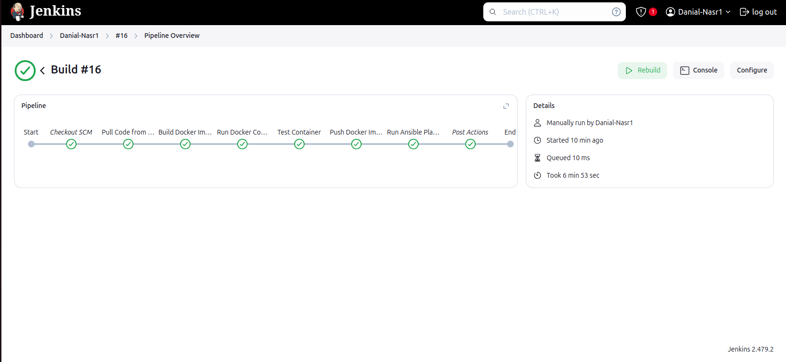
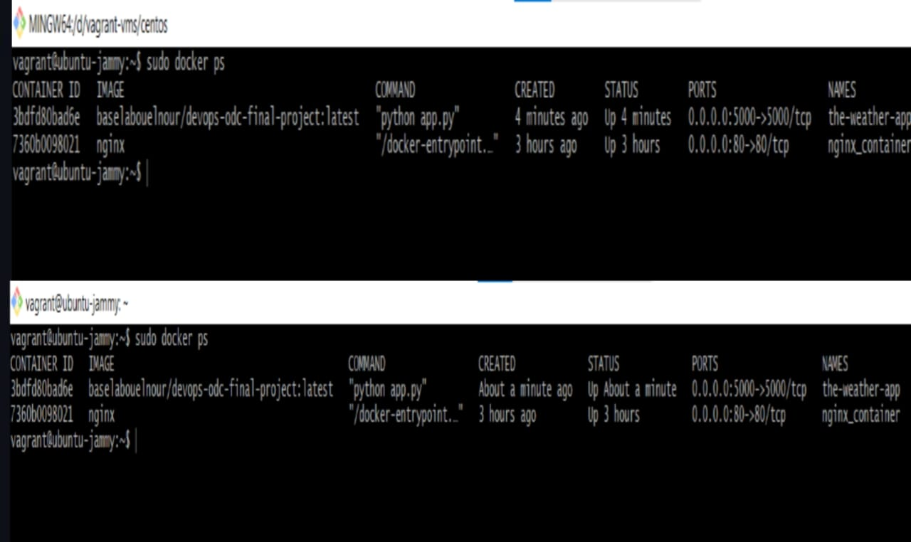
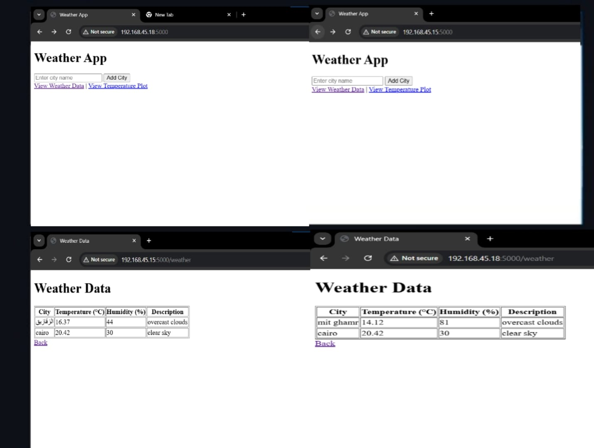

# DevOps Final Project

## Project Name

Automated DevOps Pipeline using Vagrant and Ansible

## Description

This project demonstrates the creation of a fully automated deployment pipeline using GitHub, Vagrant, and Ansible. The pipeline automates the deployment of a Python application onto two virtual machines, managing the entire lifecycle from code push to application deployment. The goal is to streamline the deployment process, enhance environment consistency, and provide a reusable pipeline for continuous integration and deployment (CI/CD).


### Features

-Integration with a private GitHub repository.

-Use of lightweight virtual machines with Vagrant.

-Execution of an Ansible playbook to manage application deployment.

-Integration with Jenkins for continuous integration and deployment.

-Integration with a private GitHub repository.

-Use of lightweight virtual machines with Vagrant.

-Execution of an Ansible playbook to manage application deployment.

### Differentiators

This project stands out by offering a simple yet powerful approach to DevOps automation using Jenkins, Ansible, and vagrant. It's optimized for smaller applications or learning environments, providing a clean and minimalistic solution that ensures smooth, reliable, and automated deployments with fewer resources.

## Visuals

-The Output of these steps should be the success of the pipeline


-The Weather app should be working on the two vagrant machines

-Result

### Application Running on Virtual Machines
- Screenshots of the application deployed on two Vagrant machines.

## Installation


- **Purpose**: Automates installation of Docker, Jenkins, and Ansible on Ubuntu.
- **Steps**:
  - Updates system packages.
  - Installs required dependencies.
  - Adds official repositories for Docker, Jenkins, and Ansible.
  - Installs Docker, Jenkins, and Ansible.
  - Adds the user to the `docker` group.
  - Tests if Docker, Jenkins, and Ansible are working.
- **Usage**:  
  Run the script with your username:  
  ```bash
  ./install_prerequisites.sh <your-username>
  ```
- **Requirements**:  
  - Ubuntu 20.04+  
  - User with `sudo` privileges  
- **Note**: Log out and back in after installing Docker to apply group changes.

### Prerequisites

1. A private GitHub repository containing the provided Python code.
2. Vagrant installed on the host machine.
3. Ansible installed on the host machine.

 # Steps
### Project Workflow: From Code to Deployment 
- The CI/CD pipeline is operational but requires further improvements for optimization and efficiency.  
   **jenkins Setup with Plugins**  
- Install required Jenkins plugins for GitHub and Docker.  
- Configure Jenkins credentials for Docker Hub.  

**Jenkins Pipeline** 
- Verify repository existence; clone if absent.  
- Retrieve updates using `git fetch`.  
- Ensure local commits match remote; pull changes if necessary.  
- Build and push Docker images to Docker Hub.  
- Set up GitHub webhook for Jenkins integration using ngrok.  

**SSH Key Creation**  
- Generate SSH keys for the Vagrant machines.  

**Log File Configuration**  
- Update log file settings to resolve issues.  

 **Ansible Inventory**
- Create an inventory file to manage Vagrant machine configurations.  

**Ansible Playbook** 
- Develop an Ansible playbook to automate deployment tasks.  

 **Ansible in Jenkins** 
- Integrate Ansible steps into Jenkins and update the Jenkinsfile accordingly.  


## Usage

- Push updates to the GitHub repository to sync application code.
- Use Ansible to deploy the updated application on the virtual machines.

### Example Output

- Access the application at `http://192.168.45.15:5000` or `http://192.168.45.18:5000` after deployment.

## Support

For any questions or support, contact:

- Email: [support@example.com](danialnasrgerges@gmail.com)
- GitHub Issues: [Project Issues](https://github.com/your-private-repo/issues)

## Roadmap

- Add monitoring using Prometheus and Grafana.
- Integrate automated testing into the deployment process.
- Expand deployment to include Kubernetes.

## Contributing

Contributions are welcome! To contribute:

1. Fork the repository.
2. Create a new feature branch.
3. Submit a pull request with a clear description.

## Authors and Acknowledgments

- **Your Name** - Project Lead
- **Orange Digital Center** - Training Provider
- Special thanks to all contributors and mentors.


## Project Status

The project is functional but needs improvements, such as enhanced monitoring and automated tests. Contributions are encouraged!

